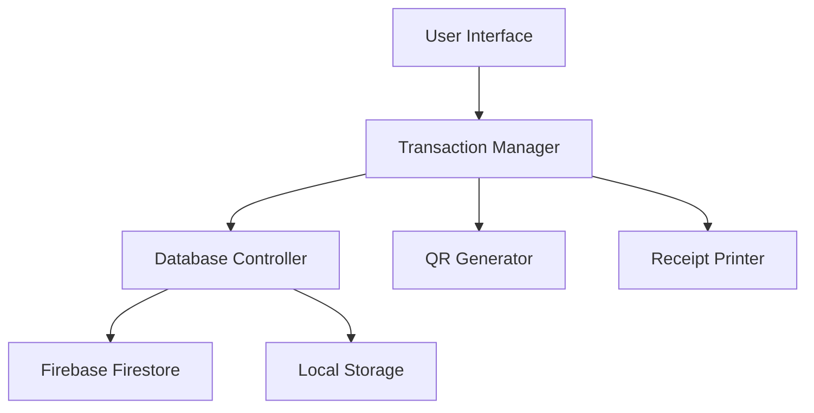

# Billing System Documentation

<div align="center">


*A Modern Point of Sale & Inventory Management Solution*

[](https://www.python.org/downloads/)
[](https://firebase.google.com/)
[](LICENSE)

</div>

## 📑 Table of Contents
- [Overview](#overview)
- [Features](#features)
- [System Architecture](#system-architecture)
- [Installation](#installation)
- [Usage](#usage)
- [Technical Documentation](#technical-documentation)
- [Security](#security)
- [Troubleshooting](#troubleshooting)
- [Contributing](#contributing)

## 🎯 Overview
The Billing System is an enterprise-grade Point of Sale (POS) and Inventory Management System designed for modern retail operations. Built with Python and Firebase, it offers real-time synchronization, secure transactions, and a user-friendly interface.

### Key Benefits
- 🚀 **Fast Processing**: Optimized for quick transactions
- 🔄 **Real-time Sync**: Instant inventory updates
- 📊 **Detailed Analytics**: Comprehensive reporting
- 🔒 **Secure**: Transaction-based operations
- 📱 **QR Payments**: Modern payment solutions

## ✨ Features

### 1. Bill Generation System
- **Smart Numbering**: 
  - Automated sequential bill numbers
  - Custom prefix support
  - Date-based tracking
```python
def generate_bill_number(self):
    prefix = "BILL"
    date = datetime.now().strftime("%Y%m%d")
    return f"{prefix}-{date}-{random.randint(1000,9999)}"
```

### 2. User Interface
- **Modern Design**:
  - Responsive layout
  - Dark/Light theme support
  - Customizable components
- **Real-time Updates**:
  - Live inventory tracking
  - Dynamic price calculations
  - Instant cart updates

### 3. Data Management
- **Multi-format Storage**:
  ```python
  bill_data = {
      "metadata": {
          "bill_number": str,
          "timestamp": datetime,
          "store_id": str
      },
      "customer": {
          "name": str,
          "contact": str,
          "email": str
      },
      "transaction": {
          "items": List[Dict],
          "subtotal": float,
          "tax": float,
          "discount": float,
          "total": float
      },
      "payment": {
          "method": str,
          "status": str,
          "qr_data": str
      }
  }
  ```

## 🏗 System Architecture

### Component Diagram


### Database Schema
```sql
Collections:
  - bills
    └─ bill_number (document)
       ├─ customer_details
       ├─ items
       ├─ payment_info
       └─ timestamps

  - inventory
    └─ product_id (document)
       ├─ name
       ├─ price
       ├─ quantity
       └─ category
```

## 🚀 Installation

### Prerequisites
- Python 3.8+
- Firebase Account
- Required Libraries:
  ```bash
  pip install -r requirements.txt
  ```

### Configuration
1. Firebase Setup:
   ```python
   {
     "apiKey": "your-api-key",
     "authDomain": "your-auth-domain",
     "projectId": "your-project-id",
     "storageBucket": "your-storage-bucket"
   }
   ```

## 💻 Usage

### Basic Operations
1. **Starting a New Bill**:
   ```python
   bill = BillingSystem()
   bill.new_transaction()
   ```

2. **Adding Items**:
   ```python
   bill.add_item(product_id, quantity)
   ```

3. **Generating QR Code**:
   ```python
   bill.generate_payment_qr(amount)
   ```

## 🔧 Technical Documentation

### Core Classes

#### `BillingSystem`
Main system controller handling all operations.

```python
class BillingSystem:
    def __init__(self):
        self.db = self.initialize_firebase()
        self.cart = ShoppingCart()
        self.printer = ReceiptPrinter()
```

#### `TransactionManager`
Handles all transaction-related operations.

```python
class TransactionManager:
    def process_transaction(self, cart):
        with self.db.transaction():
            self.validate_inventory(cart)
            self.update_stock(cart)
            self.generate_bill()
```

## 🔒 Security

### Data Protection
- **Encryption**: AES-256 for sensitive data
- **Authentication**: Multi-factor support
- **Backup**: Automated daily backups

### Transaction Safety
```python
@firestore.transactional
def safe_transaction(transaction, cart):
    try:
        # Validate stock
        # Process payment
        # Update inventory
    except Exception:
        transaction.rollback()
```

## ❗ Troubleshooting

### Common Issues
1. **Connection Errors**
   ```python
   # Check Firebase connection
   if not self.db.is_connected():
       self.reconnect()
   ```

2. **Stock Sync Issues**
   ```python
   # Force sync inventory
   self.sync_inventory(force=True)
   ```

## 🤝 Contributing
We welcome contributions! Please see our [Contributing Guide](CONTRIBUTING.md) for details.

### Development Setup
1. Clone repository
2. Install dependencies
3. Set up Firebase credentials
4. Run tests

---


## 📞 Support & Contact
- LinkedIn: [linkedin.com/company/ims-system](https://linkedin.com/company/ims-system)
- GitHub: [github.com/ims-system](https://github.com/ims-system)
- Instagram: [@ims_system](https://instagram.com/ims_system)
- Email: work.meetpatel221@gmail.com


---
